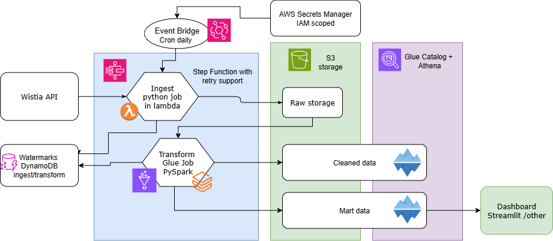
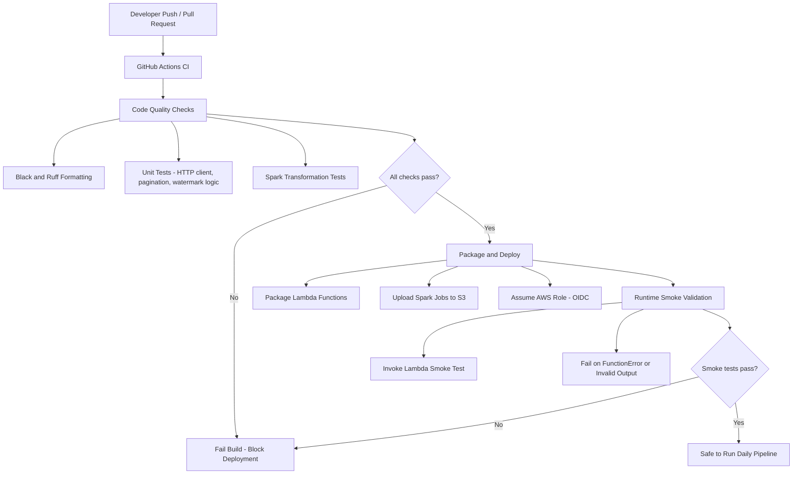

# Wistia Video Analytics – AWS Data Pipeline

> **Status:** Completed (end-to-end pipeline + CI/CD)

## Overview
This project implements a **fully automated AWS data pipeline** for ingesting and transforming **Wistia video analytics** data.  
The pipeline demonstrates event-driven orchestration, CI/CD with GitHub Actions, and multi-layer data processing using AWS-native services.

---

## Why
Marketing needs reliable, daily engagement metrics from Wistia to understand user behavior and improve content performance.

My focus for this project was to design, automate, and operate a **production-grade data pipeline**. While validating data quality near completion, I discovered that Wistia’s `/v1/stats/visitors` endpoint does **not support filtering by `media_id`**, resulting in duplicated visitor data across all media IDs.  
This was an honest oversight due to trusting a faulty reference sample and prioritizing the **CI/CD and orchestration aspects** of the build.

A fix is planned via the `/v1/stats/events` endpoint, but for this project’s evaluation, the emphasis remains on the **infrastructure, automation, and data engineering principles**.

---

## Architecture Summary

**Services used:**
- **AWS Step Functions** – pipeline orchestration and logging (DynamoDB checkpoints).  
- **AWS Lambda** – daily ingestion of Wistia Media & Visitor data (Raw/Bronze).  
- **AWS Glue Jobs (PySpark)** – Silver and Gold transformations (deduplication, aggregation).  
- **AWS S3** – Bronze → Silver → Gold storage layers.  
- **AWS DynamoDB** – watermark tracking and pipeline status.  
- **AWS Athena** – data verification and ad-hoc analytics.  
- **GitHub Actions (OIDC)** – automated deployment of Lambda and Glue jobs.

---

## Architecture Diagram



---

## Data Flow (Bronze → Silver → Gold)

| Layer | Description | Format |
|-------|--------------|--------|
| **Bronze** | Raw JSONL data from Wistia API (media & visitors) | `.ndjson` |
| **Silver** | Cleaned + typed + deduplicated PySpark outputs | `.parquet` |
| **Gold** | Aggregated media performance facts and dimensions | `.parquet` |

---

## CI/CD Highlights



- GitHub Actions deploys ingestion Lambdas and Glue jobs via **OIDC-authenticated roles** (no static credentials).  
- Artifacts zipped and pushed to S3 automatically on every commit.  
- Unit + integration tests executed on PRs (PySpark, boto3 mocks).  
- Step Function JSON definition versioned in-source and auto-deployed.  
- Smoke tests trigger sample runs for latest date.

---

## Verification (Athena Queries)

**Gold Fact Table:**
```sql
CREATE EXTERNAL TABLE wistia_gold_fact_media_daily (
  media_id           string,
  unique_visitors    bigint,
  loads              bigint,
  plays              bigint,
  play_rate          double,
  gold_ingested_at   timestamp
)
STORED AS PARQUET
LOCATION 's3://kerok-wistia-gold/gold/wistia/fact_media_daily/';
```

**Example Queries:**
```sql
-- Verify data presence
SELECT dt, COUNT(*) AS rows
FROM wistia_gold_fact_media_daily
GROUP BY dt
ORDER BY dt DESC;

-- Top media by play rate
SELECT media_id, play_rate, plays, unique_visitors
FROM wistia_gold_fact_media_daily
WHERE dt = date '2025-11-10'
ORDER BY play_rate DESC
LIMIT 10;
```

---

## Known Limitations
- Wistia `/stats/visitors` endpoint does not return per-media data despite accepting a `media_id` parameter.  
- Current pipeline associates visitors to each media for demonstration purposes only.  
- Data model and metrics remain technically correct but semantically inaccurate until the endpoint issue is resolved.

---

## Key Learnings & Achievements
- Built a **multi-step event-driven pipeline** using AWS-native components.  
- Automated deployment and testing via **GitHub Actions + OIDC**.  
- Implemented **data lineage, logging, and recovery mechanisms**.  
- Identified and documented a real-world data consistency issue.  
- Designed pipeline to be easily extended (future fix via `/stats/events`).

---

## Next Steps
- Replace `/stats/visitors` with `/stats/events` to enable true per-media visitor attribution.  
- Expand monitoring with Glue job metrics to CloudWatch dashboards.  
- Optional: add Streamlit dashboard for visual validation and sharing results.

---

© 2025 Kerok Tech LLC – AWS Data Engineering Portfolio Project
